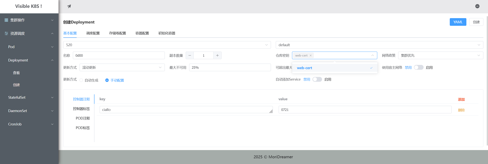
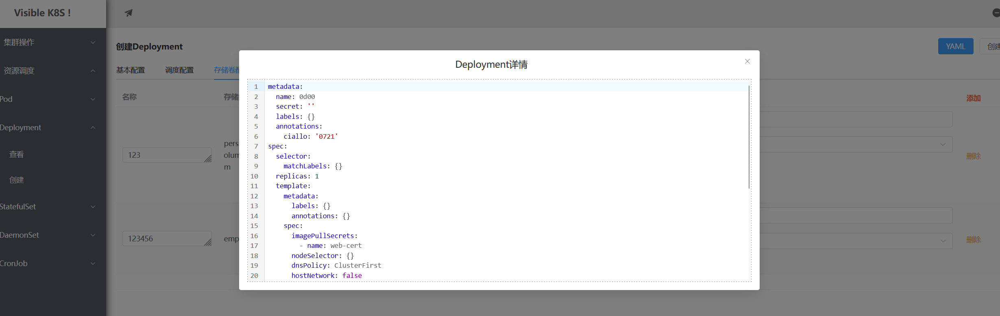

# visibleK8S的前端部分，自用
使用了VUE+AXIOS+PINIA+ELEMENT_UI，注释多，可用于运维系统、后台管理系统等自学研究.

没有做侧栏折叠，不喜欢展开样式的可以自行修改。

**根目录下的vite.config.js中注释部分关闭了访问限制，这很危险 请不要在生产环境中使用！！！**

axios封装在./src/api

路由封装在./src/router

API地址在./src/config 

以URL:/cluster/add为例子：

在cluster中使用了layout.vue && 子路由配置了add.vue

渲染顺序: 渲染layout.vue

layout中包含aside、header、main三个组件

main组件渲染RouterView

RouterView会渲染子路由的组件

这里就是渲染子路由的add.vue